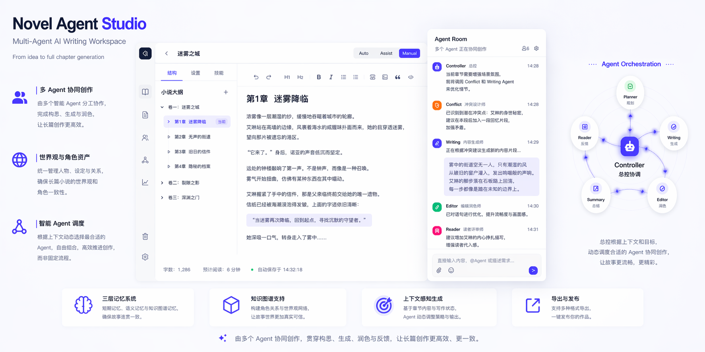

# Novel Agent Studio

<p align="center">
  
</p>

Novel Agent Studio 是一个面向长篇小说创作的多 Agent 协同工作台。它将章节规划、冲突设计、草稿生成、编辑润色、读者反馈与记忆沉淀组织成一条连续链路，帮助作者从构思推进到成稿。

项目重点解决长篇创作中的三个问题：多角色创作流程难以组织，世界观与角色设定容易失去一致性，灵感、资料、草稿与成稿分散在不同工具中。

## 核心流程

Novel Agent Studio 通过多个专业 Agent 协作完成章节生产：

1. **Planner**：规划章节目标、结构和信息节奏。
2. **Conflict**：设计冲突、悬念和场景张力。
3. **Writing**：生成章节草稿。
4. **Editor**：进行语言润色、结构修正和风格调整。
5. **Reader**：从读者视角给出反馈。
6. **Summary**：将章节结果沉淀到记忆与设定上下文中。

## 功能模块

- **Agent Room**：组织 Agent 讨论、任务规划、章节生成和决策过程。
- **章节生成**：基于大纲、上下文和世界观资产生成章节草稿。
- **世界观资产**：管理角色、地点、势力、时间线和故事设定。
- **长篇一致性**：通过记忆系统维护人物关系、设定延续和剧情上下文。
- **文本溯源**：记录生成与修改过程，方便追踪内容来源。
- **导出能力**：支持将章节内容导出为 Word 文档。

## 技术栈

**后端**

- FastAPI + Python
- LangGraph / LangChain / OpenAI
- Pydantic
- Qdrant 可选向量记忆
- Neo4j 可选知识图谱
- python-docx

**前端**

- Next.js + React + TypeScript
- Tailwind CSS
- Tiptap
- Zustand

## 项目结构

```text
Novel-Agent-Studio/
├── backend/
├── frontend/
├── docs/
├── scripts/
├── assets/          # README 图片与展示素材
├── tests/
├── docker-compose.yml
├── README.md
└── LICENSE
```

## 快速开始

### 环境要求

- Python 3.9+
- Node.js 20+
- npm 或 yarn

### 启动后端

```bash
cd backend
pip install -r requirements.txt
uvicorn app.main:app --reload --host 0.0.0.0 --port 8000
```

### 启动前端

```bash
cd frontend
npm install
npm run dev
```

启动后访问 `http://localhost:3000`。

### 使用脚本启动

```powershell
.\scripts\start-services.ps1
```

## 文档导航

- [产品与功能总览](docs/01-product/project-feature-overview.md)
- [用户指南](docs/01-product/user-guide.md)
- [Agent 框架设计](docs/02-architecture/agent-framework-design.md)
- [Agent 系统设计](docs/02-architecture/agent-system.md)
- [开发环境搭建](docs/03-development/setup-guide.md)
- [后端 API 参考](docs/03-development/backend-api-reference.md)
- [前端开发指南](docs/03-development/frontend-next-tiptap-dev.md)
- [部署指南](docs/04-deployment/deployment.md)
- [文档中心](docs/README.md)

## 许可证

[MIT](LICENSE)
